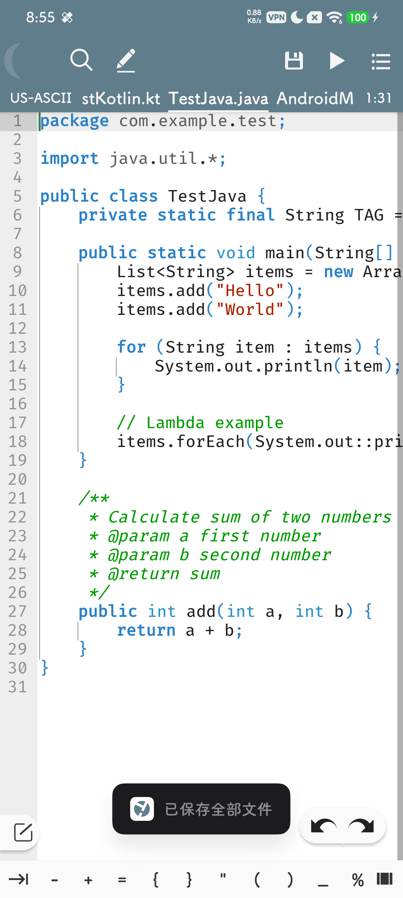
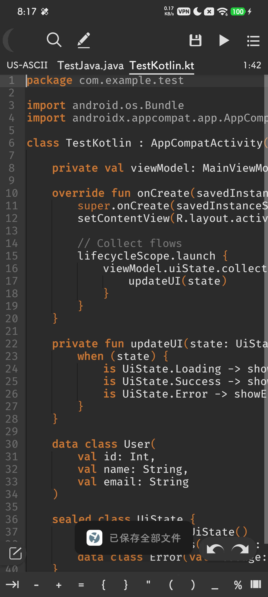
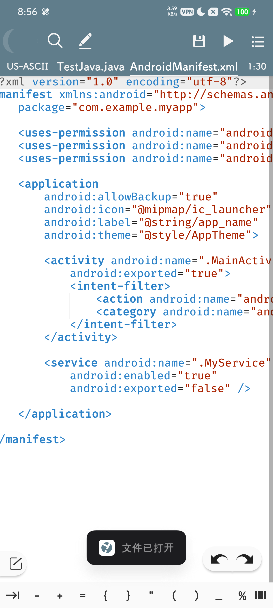
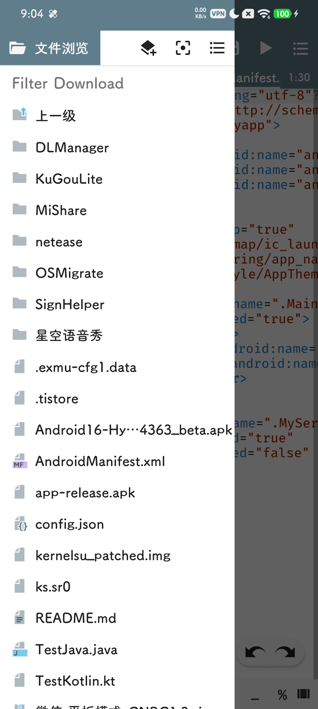

# TaoKDao

<p align="center">
  
</p>

<p align="center">
  <b>Android 平台上的 IDE / 代码编辑器</b>
</p>

<p align="center">
  <a href="https://github.com/TIIEHenry/TaoKDao">GitHub</a> |
  <a href="http://qm.qq.com/cgi-bin/qm/qr?_wv=1027&k=310289815">QQ 交流群：310289815</a>
</p>

---

## 简介

**TaoKDao** 是一款面向 Android 平台的集成开发环境（IDE）与代码编辑器，设计目标是提供类似桌面级 IDE（VSCode / IntelliJ IDEA）的开发体验。项目采用多模块架构，支持插件动态加载、多语言代码编辑、LSP 语言服务、项目构建等核心能力。

## 功能特性

| 特性 | 说明 |
|------|------|
| **代码编辑器** | 基于 Canvas 自绘的高性能代码编辑器，支持语法高亮、自动补全、代码折叠 |
| **LSP 支持** | 暂时没有集成 LSP4J，支持 Language Server Protocol，实现跨语言智能提示 |
| **语言解析** | 基于 ANTLR4 的多语言语法解析（Java、Kotlin、XML、JSON、Markdown 等） |
| **插件系统** | 动态插件加载框架，支持运行时安装/卸载插件（APK 形式） |
| **终端** | 内置终端模拟器（基于 Termux 引擎），支持 Shell 命令执行 |
| **文件管理** | 项目文件浏览与管理，支持 SAF（Storage Access Framework） |
| **Markdown 预览** | 集成 Markwon，支持实时 Markdown 渲染 |
| **项目构建** | 支持自定义构建流程与任务编排 |
| **主题切换** | 多主题/配色方案支持 |
| **崩溃监控** | 集成 xCrash，实时捕获与上报崩溃信息 |

## 界面预览

<p align="center">
  
  
</p>

<p align="center">
  
  
</p>

## 技术架构

### 架构模式

项目采用 **MVP（Model-View-Presenter）** 架构，`MainActivity` 作为核心容器，通过 20+ 个 Presenter 分别管理不同业务模块。

### 模块结构

```
TaoKDao/
├── app/                    # 主应用模块（Application）
│   └── tiiehenry.taokdao   # 应用入口与业务编排
├── common/                 # 通用基础库（AppCompat、RecyclerView、ViewBinding）
├── CodeEditor/             # 代码编辑器核心（Canvas 自绘渲染、LSP4J）
├── CodeEditorAntlr/        # ANTLR4 语言解析扩展
├── DynamicLoader/          # 动态插件加载框架
├── encodedetector/         # 文件编码检测
├── encodehelper/           # 编码转换工具
├── filej/                  # 文件操作工具
├── api_public/             # 插件公共 API 接口
├── api_skin/               # 主题/皮肤 API
├── terminal-emulator/      # 终端模拟器引擎
├── terminal-view/          # 终端 UI 渲染
└── markwon-editor/         # Markdown 编辑器
```

### 技术栈

| 技术 | 版本 | 用途 |
|------|------|------|
| Kotlin | 2.3.0 | 主开发语言 |
| Java | 17 | 兼容层与工具库 |
| Android Gradle Plugin | 9.0.0 | 构建系统 |
| Gradle | 9.1.0 | 构建工具 |
| minSdk / targetSdk | 28 / 36 | Android 兼容性 |
| LSP4J | 0.10.0 | Language Server Protocol |
| ANTLR4 | 4.8 | 语法解析器生成 |
| Markwon | 4.6.2 | Markdown 渲染 |
| MMKV | 2.3.0 | 高性能键值存储 |
| Velocity | 3.1 | 文件模板引擎 |
| XPopup | 1.9.12 | 弹窗/对话框 UI |
| Material Dialogs | 3.3.0 | 对话框框架 |
| AgentWeb | 4.1.3 | 内置 WebView |
| xCrash | 3.1.0 | 崩溃监控 |

## 构建指南

### 前置条件

- Android Studio（建议最新稳定版）
- JDK 17+
- Android SDK 36
- NDK 28.2.13676358（如需构建 native 组件）

### 克隆与构建

```bash
# 克隆主项目
git clone https://github.com/TIIEHenry/TaoKDao.git
cd TaoKDao

# 克隆 API 子项目（composite build 依赖，必须放在 ../TaoKDao-API）
git clone https://github.com/TIIEHenry/TaoKDao-API.git ../TaoKDao-API

# 构建 Debug APK
./gradlew assembleDebug

# 构建 Release APK
./gradlew assembleRelease
```

## 插件开发

TaoKDao 支持通过插件扩展功能。插件以 APK 形式分发，通过 `DynamicLoader` 动态加载。

- 插件 API 定义于 `api_public` 与 `api_skin` 模块
- 插件需在 `META-INF/plugin.xml` 中声明描述符
- 通过 `createPackageContext` 获取插件资源与类加载器

更多插件开发文档请参阅 [TaoKDao-API](https://github.com/TIIEHenry/TaoKDao-API) 仓库。

## 交流与反馈

| 渠道 | 链接 |
|------|------|
| QQ 交流群 | [310289815](http://qm.qq.com/cgi-bin/qm/qr?_wv=1027&k=310289815) |
| GitHub Issues | [TIIEHenry/TaoKDao/issues](https://github.com/TIIEHenry/TaoKDao/issues) |

欢迎提交 Issue 和 PR，参与项目共建！

这个项目是几年前的旧项目了。。。。GooglePlay上的账号也被封了，但是设计依然可以

## 开源许可

本项目基于开源协议发布（具体协议见仓库内 LICENSE 文件）。

---

<p align="center">
  <sub>Built with ❤️ by TIIEHenry and contributors.</sub>
</p>
